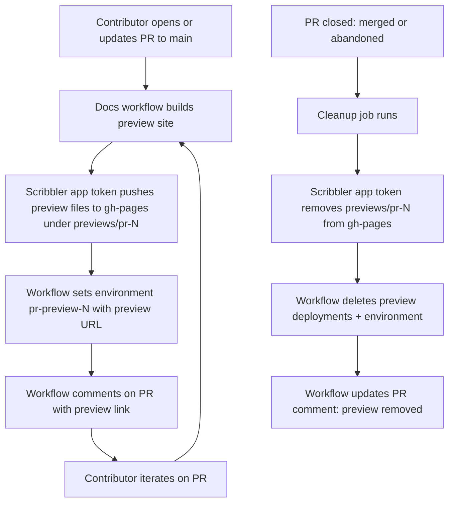

# PR docs preview setup

This repository publishes docs previews for pull requests under:

- `https://psmodule.io/docs/previews/pr-<number>/`

## What the workflow does

1. On PR open/reopen/synchronize:
   - builds docs with preview-specific `site_url`,
   - updates `previews/pr-<number>/` content by pushing directly to `gh-pages` as the Scribbler app,
   - comments on the source PR with the preview URL,
   - reports the preview URL through a named environment (`pr-preview-<number>`).
2. On PR close (merge or abandon):
   - removes `previews/pr-<number>/` by pushing directly to `gh-pages` as the Scribbler app,
   - deletes all preview deployments and the preview environment.

## Flow diagram

## Required repository configuration

1. Ensure `gh-pages` branch exists.
2. Configure GitHub Pages to publish from `gh-pages`.
3. Protect `gh-pages` and restrict push access so **only Scribbler bot app** can push.
4. In the `gh-pages` branch protection/ruleset, add **Scribbler bot app** as the only actor allowed to bypass required pull requests and any required status checks for that branch.

## Scribbler GitHub App permissions

The app needs the following repository permissions:

| Permission | Access | Why |
| --- | --- | --- |
| Metadata | Read | Required baseline for API access |
| Contents | Read & write | Push docs and preview content directly to `gh-pages` |
| Issues | Read & write | Post and update preview comments on PR threads |
| Deployments | Read & write | Deactivate and delete preview deployments |
| Administration | Read & write | Delete per-PR environments during cleanup |
