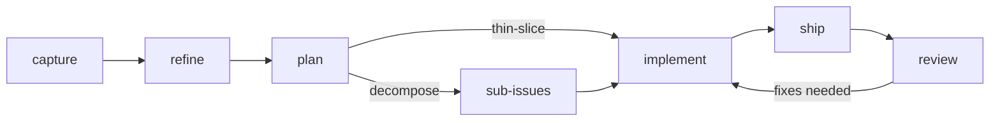

I want to restructure and iterate over the set of agents i currently have.

Guiding thoughts:

- Some of the content in these files are likely better stored as documentation in PSModule/docs, like coding standards and ways of working. Thinking that the github-author and the psmodule-module-author are better stored as documentation for our standards. Issue standards and PR standard could also be explained in a docs section on way of working, just to slim down the agent files and refer to docs with links when needed, so that an agent can collect that info when needed.
- The issue body is declarative, so it will be the final qualified work that needs to be done. We can track changes in comments with info on what was updated in the issue description. The issue description is THE SOURCE OF TRUTH.
- We do not touch a feedback issue from non-contributors. We use that issue as the initial input to an issue that decided on the work that needs to be done.
- Agent names should be named using action oriented names, or phase based. Open for suggestions.

I want to have agents that helps me on prepping issues in some phases.

- I think maybe ideation, feature request and improvements is one type of phase where the goal is to just capture the desire of change and what we want to see in the future, or even bug registration.
- Then we go over to a phase of refinement and clarification. We need to be sure we have clear understanding on what the actual desired outcome would be. This can be done by asking questions in the comments or to the user interactively in the chat. Goal is to ensure we are grounded in what the pain is, what the problem is and what the user wants.
- Next phase is decision making and planning mode. Lets go back from what we want to see and trace the work that needs to be done and decisions we need to make, revert, or just throw out the window. We should be tracking the necessary decisions on a separate section in the issue body.

I need to implement modes to this custom agent:

I want it to be able to just create a request, without going into technical decision making and planning, just focus on the current state and situation, describe the thing that needs to improve, and the desired outcome. This should be somewhat of a precursor to feature specifications. Its just we want this thing to exist.

I want to also use it for planning, so that we start discussing requirements and decisions, have it ask questions about the setup and grill me on things that seem unclear or decisions we need to make, potential dependencies. By default it should focus on the thinnest line of work to get going, so that we can iterate and get experience, then later have review of what should be next (separate planning agent for this).

I want to be able to instruct the agent to make sub-issues for groups of work that have clear deliveries or interfaces or phases of work that need to be done, with the goal of having multiple workers start working, one issue each. So if we start ideating.

Help me plan this out and bounce some ideas of me. Review what i have in the agents folder and then suggest and overall plan.

---------------------------------------------------------

Let me review your current agent files to understand what you have.

Read [](file:///c%3A/Repos/github.com/PSModule/Other/.github-private/agents/issue-manager.md#1-1), lines 1 to 100

Read [](file:///c%3A/Repos/github.com/PSModule/Other/.github-private/agents/code-reviewer.md#1-1), lines 1 to 100

Read [](file:///c%3A/Repos/github.com/PSModule/Other/.github-private/agents/github-author.md#1-1), lines 1 to 100

Read [](file:///c%3A/Repos/github.com/PSModule/Other/.github-private/agents/issue-manager.md#101-101), lines 101 to 200

Read [](file:///c%3A/Repos/github.com/PSModule/Other/.github-private/agents/github-author.md#101-101), lines 101 to 200

Read [](file:///c%3A/Repos/github.com/PSModule/Other/.github-private/agents/pr-manager.md#1-1), lines 1 to 200

Read [](file:///c%3A/Repos/github.com/PSModule/Other/.github-private/agents/issue-manager.md#201-201), lines 201 to 350

Read [](file:///c%3A/Repos/github.com/PSModule/Other/.github-private/agents/pr-manager.md#201-201), lines 201 to 350

Read [](file:///c%3A/Repos/github.com/PSModule/Other/.github-private/agents/pr-reviewer.md#1-1), lines 1 to 100

Read [](file:///c%3A/Repos/github.com/PSModule/Other/.github-private/agents/issue-manager.md#351-351), lines 351 to 410

Read [](file:///c%3A/Repos/github.com/PSModule/Other/.github-private/agents/pr-reviewer.md#101-101), lines 101 to 200

Read [](file:///c%3A/Repos/github.com/PSModule/Other/.github-private/agents/psmodule-module-author.md#1-1), lines 1 to 100

Read [](file:///c%3A/Repos/github.com/PSModule/Other/.github-private/agents/psmodule-module-author.md#101-101), lines 101 to 300

Read [](file:///c%3A/Repos/github.com/PSModule/Other/.github-private/instructions/readme-driven-context.md)

Now I have a solid picture of your current agent setup. Let me synthesize what I see and propose a restructuring plan.

---------------------------------------------------------

## Analysis of Current State

**What you have today:**

| Agent | Size | Role |
| ----- | ---- | ---- |
| issue-manager.md | ~400 lines | Structures issues into a rigid 3-section format (context, technical decisions, implementation plan) |
| pr-manager.md | ~350 lines | Creates PRs with release-note style descriptions |
| pr-reviewer.md | ~200+ lines | Iterative review loop for active PRs |
| code-reviewer.md | ~100 lines | Reviews code against standards and issue requirements |
| github-author.md | ~200 lines | GitHub Actions authoring/reviewing (security hardening) |
| psmodule-module-author.md | ~300+ lines | PowerShell module implementation conventions |

**Key observations:**

1. **`psmodule-module-author`** is 80% coding standards documentation (naming, layout, parameter design, style) and 20% agent behavior. This belongs in `PSModule/docs` as reference material the agent links to.

2. **`github-author`** is similar — it's mostly a security checklist (Zizmor, SHA pinning rules, OIDC patterns). The agent behavior is thin ("read existing, verify, produce").

3. **`issue-manager`** currently does ONE thing: restructure an issue into the 3-section format. It doesn't distinguish between ideation, refinement, and planning phases. It jumps straight to "technical decisions + implementation plan" which is premature for early-stage work.

4. **`code-reviewer`** and **`pr-reviewer`** overlap (both review code on PRs), with `code-reviewer` being a lighter pre-flight and `pr-reviewer` being the full iterative loop.

5. The issue format documentation (what a well-structured issue looks like, formatting rules, labels) is also better as docs that agents reference.

---------------------------------------------------------

## Proposed Restructuring

### Principle: Agents are thin orchestrators that reference docs for standards

Agents should be: **action-oriented, phase-aware, and slim**. Heavy reference material (coding standards, issue format spec, GHA security rules) lives in docs and gets fetched when needed.

### Documentation to extract to `PSModule/docs`

| Doc | Content |
| --- | ------- |
| `way-of-working/issue-format.md` | The 3-section structure, formatting rules, title conventions, labels, comment conventions |
| `way-of-working/pr-format.md` | PR description structure, title conventions, change types, release note style |
| `standards/powershell-module.md` | Everything currently in `psmodule-module-author` about layout, naming, style, parameter design |
| `standards/github-actions.md` | The SHA pinning, permissions, Zizmor checklist, security rules |
| `way-of-working/issue-lifecycle.md` | The phases: ideation → refinement → planning → implementation → review |

### New Agent Structure (Phase-Based Naming)

```text
agents/
  capture.md          # Phase 1: Ideation / Request capture
  refine.md           # Phase 2: Clarification & grounding
  plan.md             # Phase 3: Decision making, planning, decomposition
  implement.md        # Phase 4: Code authoring (replaces psmodule-module-author + github-author)
  ship.md             # Phase 5: PR creation & packaging (replaces pr-manager)
  review.md           # Phase 6: PR review loop (merges code-reviewer + pr-reviewer)
```

---------------------------------------------------------

### Agent Details

#### `capture.md` — "Capture a desire for change"

**Modes:**

- **Feature request** — "I want this thing to exist"
- **Bug report** — "This thing is broken"
- **Improvement** — "This works but should be better"

**Behavior:**

- Does NOT do technical planning
- Focuses on: current state, pain/gap, desired outcome
- Output: Issue with Section 1 only (Context + Request)
- Searches for duplicates before creating
- If input is from a non-contributor feedback issue: reads it as input, creates a qualified internal issue, links back
- Tone: user-perspective, no implementation details

**Key difference from current `issue-manager`:** No Section 2 or 3. Just the desire. Clean, fast, low-ceremony.

#### `refine.md` — "Ensure we understand the problem"

**Behavior:**

- Takes an existing issue (from capture phase or external input)
- Asks clarifying questions (interactively in chat or as comments on the issue)
- Grills you on: What's the actual pain? What's the real problem vs. symptom? What does "done" look like from the user's POV?
- Validates acceptance criteria are testable and unambiguous
- Updates Section 1 with refined understanding
- Tracks changes in comments
- Does NOT make technical decisions yet

**Interactive mode:** Can run as a conversation where it asks you questions and challenges assumptions.

#### `plan.md` — "Decide and decompose"

**Modes:**

- **Thin-slice mode (default):** Find the minimum viable path to get going. One issue, one delivery.
- **Decompose mode:** Break work into sub-issues with clear interfaces/deliverables for parallel workers.
- **Review mode:** Look at a set of related issues and suggest what's next (prioritization, dependencies).

**Behavior:**

- Traces backward from desired outcome to work needed
- Identifies decisions that must be made (adds Section 2: Technical Decisions)
- Marks open decisions explicitly — asks you about them
- Creates implementation plan (Section 3) only after decisions are resolved
- In decompose mode: creates sub-issues with dependency relationships, each scoped for one worker
- Tracks dependencies between sub-issues
- Questions you on: unclear interfaces, hidden assumptions, potential blockers, things that seem under-specified

**Key principle:** Issue description is THE SOURCE OF TRUTH. It gets updated as decisions are made. Comments track what changed.

#### `implement.md` — "Write the code"

**Behavior:**

- Reads the issue (all 3 sections must be present)
- Follows the implementation plan task by task
- References coding standards docs (fetches from `PSModule/docs` links as needed)
- Knows how to work on: PowerShell modules, GitHub Actions, general code
- Micro-iterative: one commit per logical change

**Slimmed down** from current `psmodule-module-author` — the standards live in docs, the agent just follows them.

#### `ship.md` — "Package work into a PR"

Essentially the current `pr-manager` but slimmed — PR format rules live in docs.

#### `review.md` — "Review and iterate on PRs"

Merges `code-reviewer` + `pr-reviewer` into one agent with two modes (pre-flight vs. active review), as they already partially overlap.

---------------------------------------------------------

### Sub-Issue Decomposition (in `plan.md`)

When you tell the planner to decompose:

1. It identifies logical work groups (by interface boundary, delivery phase, or clear module/component)
2. Creates sub-issues, each with:
   - Its own Section 1 (scoped context + acceptance criteria)
   - Reference to parent issue
   - Clear input/output interface if dependent on other sub-issues
   - Labels for sequencing (`phase:1`, `phase:2` or `blocked-by:#N`)
3. Updates the parent issue's implementation plan to reference sub-issues instead of inline tasks
4. Each sub-issue is designed to be picked up by one worker independently

---------------------------------------------------------

### Workflow Diagram



---------------------------------------------------------

## Questions Back to You

1. **Naming style** — I proposed phase verbs (`capture`, `refine`, `plan`, `implement`, `ship`, `review`). Alternatives:
   - Action-imperative: `capture-request`, `clarify-intent`, `plan-work`, `write-code`, `open-pr`, `review-pr`
   - Role-based: `ideator`, `clarifier`, `planner`, `builder`, `shipper`, `reviewer`
   - Do any of these resonate more?

2. **Non-contributor feedback issues** — You said "don't touch them." Should `capture` automatically create a new internal issue and link it? Or should `refine` handle the translation from external feedback → internal qualified issue?

3. **Thin-slice vs. decompose** — Should these be modes of the same `plan` agent, or separate agents (`plan.md` + `decompose.md`)? I leaned toward modes since the input and output format are the same, just the granularity differs.

4. **Where do the extracted docs live?** — You mentioned `PSModule/docs`. Is that a separate repo? Should the agent files contain direct URLs to those docs, or use a relative reference pattern?

5. **The `implement` agent** — Should it stay as one agent that handles both PowerShell modules and GitHub Actions (switching based on context), or remain split into specialized implementers?

---------------------------------------------------------

The idea was that the PR-Reviewer agent was meant to be used by the authors side to answer feedback from someone and look at errors in CI, and the code-reviewer from a PR reviewers side to look for missing things in the contribution on a PR. So come with feedback ensure that good taste was followed, that security best practices are followed etc. So the names of those agents are clunky.

Thinking a lot of this could almost be blog posts, but they tend to be outdated. So i want this to be more of a documentation that is evergreen.

I want to create a separate section in my docs for agents documentation so that i can capture principles there.
I want to have the agent work with a human interface, not the other way around for now. Humans use issues, PRs, readable docs etc. So all definitions, guidelines and standards are consise, but human readable, and agents refer to that doc (which they are already good at).

I agree with the goal of moving docs out of the agents definitions and into the PSModule/docs repo for something to publish and refer to.

Lets for now treat this as creating new agent definitions and archiving the current ones. I want to be able to have them available and remove them myself at a later time.

I want plan to also create "epic" level issues that can be used as a tracker of more work that needs to be done. One sub-issue is one delivery, and if a body of work has more than one deliverable, it should be broken down to smaller chunks. So nested set of sub-issues are fine. Thinking epic-feature-task type of breakdown. Use issue types for this segmentation of work.

I think i want 3 levels that the planner agent can work on.

- Task - The single thing that will deliver one deliverable. This should be the size of a small PR that's easy to review and easy to reason on. The PR is always linked back to a task type issue. A PR can some times contain more issues. If its a small body of work to address a request, a single issue of this type is all that is needed.
- Feature, but a name that also works for something that doesn't become a feature. I like Broduct Backlog Item, as it has a more "neutral" vibe. "Just a collection of work". If work is bigger, then we need to break the work down to smaller items, and link them to a issue type with greater scope. The only goal here is tracking, delegation and still have oversight and visibility into progress.
- If something requires multiple bigger chunks of work to be able to deliver, then we create a bigger level of item. Typically called epic i think.
- The levels are meant as a way to track and aggregate progress, show connected work, used with "SaFE" or "Nexus" in planning literature, an epic would be a good place where teams co-plan. "As a business we want to deliver this, what do we collectively need to do". This makes it easy to break down OKRs to initiatives (epics) and start delegating the work.

Guding principles and practices:

- The Golden Circle from "Start with Why?" - Gound ourself in why we are doing something. Explain the world as it should be. In some cases it could be good to explain the issues with the current situation. Then come down to how we want to do it. We should try to link the concept of Why, how, what to Vision, mission and OKRs. And the link from that into Initiatives / Epics a
- Start with a vision - What change would you want to make on the world?- What is the specific work here deliver to move the needle?
  - Our vision, just make it easy - Enable others to do more - faster.
- Mission -> Starts on a project level i think. What is the PSModule mission - its to infuse GitHub with PowerShell, but also bring more to the PowerShell ecosystem - using the GitHub platform to its extent.
- OKRs - Measure what matters - Goal setting from outside in. What do we need to see, measure it, and make goal for those measurements, but they need to drive the right incentive. People should read them and be able to come with ideas on how they can contribute to it. Not as KPIs where you have specific measurements on behavior that needs to be met.
- Product/service mindset - we are delivering something that people should want to use. Without them, we are nothing.
- Dog food your services - Be your first customer - but be sure to not fully depend yourself on what you are building first. Explore and use it in non-critical
- Agent delegation - Agent as a team member
- Human-Agent cooperation, Human Augmentation
- Allow selfimproving agents - everywhere. But for this they need feedback and a way to process that feedback.
- Team augmentation -> Work as one of us.
- Use agents/LLMs to do non-deterministic work - like developing new features and automations, but decide carefully if it should be placed instead of deterministic programming (like a program or a script).
- i.e. create libraries for doing something or converting something back and forth - use AI to create that - so that we dont burn tokens on doing the deterministic work.
- What kind of deterministic work should it to?
- Getting Things Done - David Allens concept of boosting productivity. Also makes sense when working with a team and agents. If only you know, no one else can work with you or do the work for you. If its in your mind, then it might escape you mind and be lost. If its not written, you dont have anything to start to process. Writing it down lets you reflect and discuss with others.
- Everything as Code, EVERYTHING - The bedrock of Human - Agent interaction
- Documentation lives close to the thing it documents.
- SOLID - All of it, but written in clear text what that means.
- DRY - Keep things one place if they are the same.
- 1-2-automate - Usually you also just know, so Extreme Automation might sometimes be the best place to start.
- 4-eyes-principle - or with AI, you just bounce with them to get some review, or better yet, have multiple agents work together to ensure we have correct implementation based on desired outcome.
- Local testing for quicker iterations - Make it easy to build, test and run locally - Feeds into quicker innerloop iterations. (should probably define inner loops and outerloops, there are multiple based on reference/perspective)
- Roadmapping:
  - Planning in 3 horizons - Now, Next, Later
  - Planning on 3 levels - Conseptual, Logical and detailed
  - Planning can therefore be done in a 3x3 matrix, Now, next, later + Conseptual, Logical and Detailed.
- Test Driven Development - We need to define the tests and take care when we update them.
- Human in the loop - Agents help us do better work - they are not here to replace us on all aspects yet.
- DevOps (including SRE) - Everything is continuous, ever evolving, ever changing. Lets create systems, practices and teams that understand they are in on the whole loop. "You build it, you run it".
- Context Development Lifecycle -> We ensure we have the right context and that we maintain that as a product that is evergreen and declarative.
- Software Development Lifecycle -> We deliver the software using source code management, ci/cd tooling and build tools from DevOps, SRE to deliver software and services.
- Lean Software Development (often also linked with YAGNI, Ya aint gonna need it).
  - Start very very thin, so you can enable iteration. Get the teams ideas flowing, enable more people to contribute to the work.
- Clean Code
  - Write so things are understandable.
- Evolutionary design/architecture
  - Dont decide what you dont know. Experiment, iterate and treat design as you would a product, its NOT rigid and set.
- Quick iteration from and within the following phases. This is true for big things and even small features. Best feedback is the one we get when people have seen the thing we are building:
  1 Spike/Experiment, usually more of them in parallel - can the thing we want to build, actually be built?
  2 PoC, to validate concepts and can the spikes/experiments live in the real world?
  3 MVP, first thing we can run in production - Start getting experience and feedback from users
  4 Improvements to stabilize and add functionality

- Ways of working, one size doesn't fit all, but should also be following the principles above, for evolving the way of working.
  - We start lean with processes and ceremonies, we need to get to know each other, fully get a grasp of what we are going to deliver, get an understanding of what makes people tick and how they work together.
  - Scrum + Kanban = Dynamic "sprints" where we dont need a firm end date. When an epic is implemented, a cycle is over. Estimation when that epic is implemented depends on what else gets thrown in of necessary work, but even the epic is Lean.
    - Limit work in progress - WIP - Find research - I think ive read something that 3 is the typical WIP limit for the human brain.
  - Extreme Programming - We do pair programming as a type of learning, decision making, review and code validation.

Agentic development

- Swarming - Plentifull - specialized bots
  - Good for defined work
- Persona - An agentic ecosystem acting as one all-present, all-knowing entity -> Cleo - My team mate
  - Agents are the personas abilities to imact the world, just like a persons skills and abilities to perform some task.
  - One brain with a cohesive bank of knowledge that it can use in all aspects of its work.
  - Integrations and sensoring
    - Integrations - the agents ability to do something on a platform/service as if it was human
    - Sensoring - the agents ability to experience change and need of its presence. i.e. webhooks or scheduled checks.

Many thoughts.

Lets start to create some drafts with these ideas and keep it as a place to co-create on this for now.

The diagram for the agent workflow i like. We should marry it with the software development lifecycle and context development lifecycle + DevOps :)
Maybe use figma to draw it instead of mermaid.

Answers to questions:

- Agent naming style - I linked the role based approach
- Capture should be the one that looks at an issue and decide if we need to make a action based issue that has a concrete outcome for the provided feedback. Feedback here can also be issues started from failures in the platform/application logs.
- The plan agent should be deciding this based on its understanding of the work to be done.
- Extracted docs live in PSModule/docs that is a separate repo, and its published on the web via GitHub pages reachable on <https://psmodule.io/docs>. Agents can have links to the docs, their links should ideally not change, but we can update that if needed.
- The implement agent should look at the decision on what language, and then reference the docs for guidance on how to write that language. It should also consider the linting rules for the language that is available in the repo, if not apply the same linter rules.

---------------------------------------------------------

Read [](file:///c%3A/Repos/github.com/PSModule/Docs)

Read [](file:///c%3A/Repos/github.com/PSModule/Docs/docs/docs/ideas.md)

Read [](file:///c%3A/Repos/github.com/PSModule/Docs/docs)

Read [](file:///c%3A/Repos/github.com/PSModule/Docs/docs/docs)

Created 5 todos

Read [](file:///c%3A/Repos/github.com/PSModule/Docs/docs/docs/About)

Read [](file:///c%3A/Repos/github.com/PSModule/Docs/docs/mkdocs.yml#1-1), lines 1 to 120

Got it. Let me start drafting. I'll:

1. Archive the existing agents (move to `agents/archive/`)
2. Create new role-based agent drafts in `.github-private/agents/`
3. Create a new Agents docs section in `PSModule/Docs` to host evergreen principles, workflow, and format specs

Archiving first:

Ran terminal command: cd c:\Repos\github.com\PSModule\Other\.github-private; New-Item -ItemType Directory -Path agents\archive -Force | Out-Null; Move-Item agents\code-reviewer.md agents\archive\; Move-Item agents\github-author.md agents\archive\; Move-Item agents\issue-manager.md agents\archive\; Move-Item agents\pr-manager.md agents\archive\; Move-Item agents\pr-reviewer.md agents\archive\; Move-Item agents\psmodule-module-author.md agents\archive\; Get-ChildItem agents -Recurse | Select-Object FullName

Archived. Now creating the new agent drafts and the docs structure in parallel.

Created [](file:///c%3A/Repos/github.com/PSModule/Other/.github-private/agents/README.md)

Created [](file:///c%3A/Repos/github.com/PSModule/Other/.github-private/agents/ideator.md)

Created [](file:///c%3A/Repos/github.com/PSModule/Other/.github-private/agents/clarifier.md)

Created [](file:///c%3A/Repos/github.com/PSModule/Other/.github-private/agents/planner.md)

Created [](file:///c%3A/Repos/github.com/PSModule/Other/.github-private/agents/builder.md)

Created [](file:///c%3A/Repos/github.com/PSModule/Other/.github-private/agents/shipper.md)

Created [](file:///c%3A/Repos/github.com/PSModule/Other/.github-private/agents/reviewer.md)

Created [](file:///c%3A/Repos/github.com/PSModule/Other/.github-private/agents/responder.md)

Starting: *Establish new documentation section for agents* (3/5)

Agents drafted. Now the docs section.

Created [](file:///c%3A/Repos/github.com/PSModule/Docs/docs/docs/Agents/index.md)

Created [](file:///c%3A/Repos/github.com/PSModule/Docs/docs/docs/Agents/Principles.md)

Created [](file:///c%3A/Repos/github.com/PSModule/Docs/docs/docs/Agents/Workflow.md)

Created [](file:///c%3A/Repos/github.com/PSModule/Docs/docs/docs/Agents/Issue-Format.md)

Created [](file:///c%3A/Repos/github.com/PSModule/Docs/docs/docs/Agents/Issue-Hierarchy.md)

Created [](file:///c%3A/Repos/github.com/PSModule/Docs/docs/docs/Agents/PR-Format.md)

Created [](file:///c%3A/Repos/github.com/PSModule/Docs/docs/docs/Agents/Commit-Conventions.md)

Created [](file:///c%3A/Repos/github.com/PSModule/Docs/docs/docs/Agents/Review-Etiquette.md)

Created [](file:///c%3A/Repos/github.com/PSModule/Docs/docs/docs/Agents/Readme-Driven-Context.md)

Created [](file:///c%3A/Repos/github.com/PSModule/Docs/docs/docs/Agents/Standards/index.md)

Completed: *Establish new documentation section for agents* (3/5)

Now the two standards docs and the mkdocs nav update.

Created [](file:///c%3A/Repos/github.com/PSModule/Docs/docs/docs/Agents/Standards/PowerShell-Module.md)

Created [](file:///c%3A/Repos/github.com/PSModule/Docs/docs/docs/Agents/Standards/GitHub-Actions.md)

Replacing 4 lines with 18 lines in [](file:///c%3A/Repos/github.com/PSModule/Docs/docs/mkdocs.yml)

```text

```

All drafts in place. Here's what got built:

## In `.github-private/agents/`

**Archived** (preserved for reference): `archive/code-reviewer.md`, `archive/github-author.md`, `archive/issue-manager.md`, `archive/pr-manager.md`, `archive/pr-reviewer.md`, `archive/psmodule-module-author.md`.

**New role-based agents** (slim orchestrators that reference docs):

- agents/README.md — overview of the lifecycle and roles
- agents/ideator.md — capture phase; modes for feature / bug / improvement / triage; never modifies non-contributor feedback issues
- agents/clarifier.md — refine phase; interactive, asks questions, sharpens Section 1
- agents/planner.md — plan phase; chooses Epic / PBI / Task level; supports thin-slice, decompose, and planning-review modes
- agents/builder.md — build phase; picks standards based on language and respects repo linter rules
- agents/shipper.md — ship phase; draft PR + release-note style
- agents/reviewer.md — third-party PR review (replaces old "code-reviewer")
- agents/responder.md — author-side PR loop (replaces old "pr-reviewer")

## In `PSModule/Docs` — new Agents docs section

Reachable at `https://psmodule.io/docs/Agents/` once published:

- Agents/index.md — overview + persona (Cleo) concept
- Agents/Principles.md — Golden Circle, vision/mission/OKRs, GTD, SOLID, DRY, Lean, TDD, DevOps, CDLC, evolutionary design, 3×3 roadmapping, ways of working
- Agents/Workflow.md — lifecycle diagram, CDLC × SDLC, inner/outer loops, mention of the future Figma diagram
- Agents/Issue-Format.md — three-section structure, formatting, labels
- Agents/Issue-Hierarchy.md — Task / PBI / Epic, nested decomposition, promotion/demotion
- Agents/PR-Format.md — release-note style, change-type detection, pre-1.0.0 rule
- Agents/Commit-Conventions.md — no conventional commits, direct messages
- Agents/Review-Etiquette.md — tone, scope, severity prefixes
- Agents/Readme-Driven-Context.md — repo-level evergreen context
- Agents/Standards/index.md, PowerShell-Module.md, GitHub-Actions.md — extracted from the archived agents

Plus an updated mkdocs.yml nav so the new section shows up between Solutions and Blog.

## Things to consider next

1. **Cleo persona** — should it stay an in-jokey name (Principles + index reference it) or stay anonymous in published docs?
2. **Figma diagram** — the Workflow page references it but it doesn't exist yet. Want me to add a placeholder section with TODO, or remove the mention until it's drawn?
3. **archive** — should I add a README.md inside `archive/` noting deprecation date and which new agent replaced each, to make the eventual cleanup easy?
4. **GitHub issue type names** — I used `Task`, `PBI`, `Epic`. PSModule's GitHub config may already use specific issue-type names; happy to align once you confirm them.
5. **Standards coverage** — only PowerShell modules and GitHub Actions migrated so far. Other languages (Markdown, JS, etc.) referenced but not yet documented — intentional, per "grow as we go" stance in Standards index.

Starting: *Define agent roles and responsibilities* (4/5)

Made changes.
