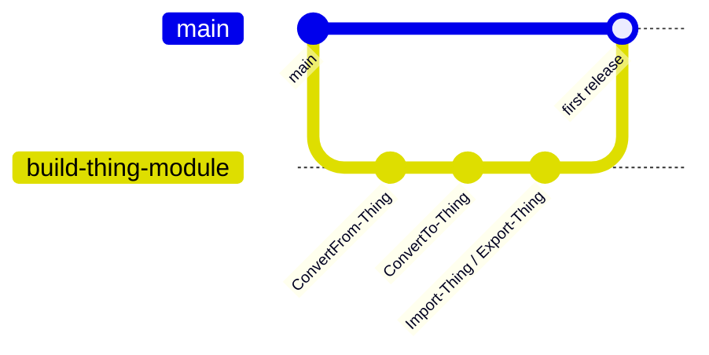

# Module Bootstrap

A brand-new module often needs several interdependent functions before it is usable at all — for example a module might need `ConvertFrom-Thing`, `ConvertTo-Thing`, `Import-Thing`, and `Export-Thing` together before any of them is meaningful on its own. A single feature PR cannot carry that much scope and still be small and focused, so bootstrap uses one integration branch instead.

## Pattern

1. Cut one long-lived branch from the default branch for the initial release, named for the outcome, e.g. `build-thing-module`.
2. Open one pull request per function (or small group of related functions) targeting that branch instead of `main`. These PRs can land in parallel — there is no strict order between them, unlike a [stacked pull request](https://msxorg.github.io/docs/Ways-of-Working/Branching-and-Merging/#stacked-pull-requests).
3. Once the foundational set of functions is coherent and complete, open the pull request that merges the integration branch into `main`. This becomes the module's first real release.
4. Smaller follow-up features (one more function, a formatter, an alias) can keep targeting the integration branch before it lands, the same way they targeted it during bootstrap.

## Example

A module bootstrapped this way:

| PR | Targets | Contents |
| --- | --- | --- |
| #1 | `main` | `build-thing-module` branch, the foundational `ConvertFrom-Thing`, `ConvertTo-Thing`, `Import-Thing`, `Export-Thing` release |
| #2 | `build-thing-module` | `Format-Thing`, a follow-up feature added before the integration branch merged |

## When to use this

- The module has no usable release yet, and no single function is meaningful without the others.
- Use this only for the initial bootstrap. Once `main` has a first release, ongoing feature work targets `main` directly with ordinary topic branches, or a [stacked pull request](https://msxorg.github.io/docs/Ways-of-Working/Branching-and-Merging/#stacked-pull-requests) when changes genuinely depend on each other.

For the general branching and merge model, see [MSX Branching and Merging](https://msxorg.github.io/docs/Ways-of-Working/Branching-and-Merging/).
