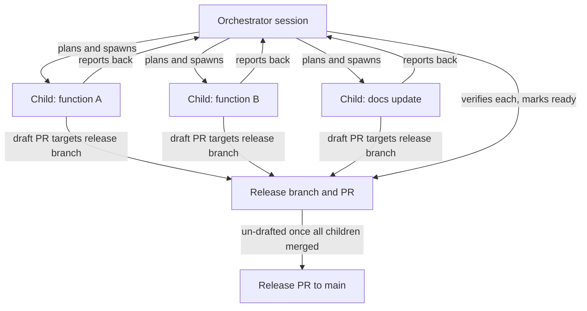

# Module Development Orchestration

Building a module from scratch, or adding a significant feature set to one, is rarely a single reviewable change. It decomposes into a load-bearing core plus a set of independent functions, docs, and fixes (see [Module Bootstrap](module-bootstrap.md)). When the number of independent pieces grows past what one contributor can hold in their head at once, coordinate the work across multiple sessions instead of one long session trying to do everything serially.

This page defines that orchestration pattern: one orchestrator session, many single-purpose child sessions, and one release branch that collects them all before it reaches `main`.

## Orchestration pattern

Three roles, three responsibilities:

1. **Orchestrator session** — the main session. It plans the work, spawns child sessions, reviews and integrates their results, handles cross-cutting concerns (shared helpers, naming consistency, conflicting design decisions), and keeps the release branch and its pull request current.
2. **Child sessions** — each owns exactly one well-scoped task: one function, one documentation update, one fix. Each opens its own draft pull request targeting the release branch, never `main`. Each reports back to the orchestrator when its task is complete.
3. **Release branch and pull request** — the orchestrator owns this branch and its pull request into `main`. Every child pull request targets it, following the [Module Bootstrap](module-bootstrap.md#pattern) pattern. The release pull request is only taken out of draft once every child pull request has merged into it.

This is the same one-deliverable-per-pull-request discipline as any other change (see [Branching and Merging](https://msxorg.github.io/docs/Ways-of-Working/Branching-and-Merging/)); orchestration only adds the coordination layer that keeps many of these moving at once without collapsing them into one unreviewable diff.

## Model selection by task type

Not every task needs the same model. Match the model to the reasoning depth and context the task actually requires — heavier models cost more turns and time without improving well-scoped work, and lighter models struggle with genuinely hard reasoning.

| Task type | Recommended model | Notes |
| --- | --- | --- |
| Orchestration / coordination / planning | `claude-sonnet-5` or `claude-sonnet-4.6` | Needs good reasoning and tool use, but runs many turns, so avoid the heaviest model. |
| Complex implementation (parser, serializer, algorithm) | `claude-sonnet-5` or `claude-opus-4.x` | Benefits from deeper reasoning; may need a longer context window. |
| Simpler implementation (single function, small helper) | `claude-sonnet-4.6` | Faster, still high quality for a well-scoped, single-function task. |
| Documentation writing | `claude-sonnet-5` | Good at clear, definitive prose. |
| Standards review / audit | `claude-sonnet-5` | Needs broad knowledge of the standards documents being checked against. |
| Test writing | `claude-sonnet-4.6` | Pester tests are well-scoped; a lighter model is sufficient. |
| Research / exploration | `claude-sonnet-5` or `claude-opus-4.x` | Use when unfamiliar code or an unfamiliar API needs deep investigation. |

## Child session coordination protocol

The orchestrator hands each child session everything it needs to work without coming back to ask:

- The exact task scope — one function, one doc page, one fix. Not a bundle.
- The base branch to work from (the release branch, not `main`).
- The target for its pull request (the release branch).
- The orchestrator's session identifier, so the child can report back.
- The relevant standards references for its task (see [Standards](../Standards.md), [Test Specification](../Test-Specification.md), [Coding Standards](https://msxorg.github.io/docs/Coding-Standards/)).

Each child session must, before reporting back:

- Open its pull request as a **draft** immediately, so CI attaches from the first commit.
- Use plain, descriptive commit messages — no `feat:`, `fix:`, `docs:`, or other conventional-commit prefixes (see [Commit Conventions](https://msxorg.github.io/docs/Ways-of-Working/Commit-Conventions/)).
- Write full comment-based help on every function it adds or touches, public and private alike.
- Add `Write-Verbose` calls to every public function.
- Ensure every `.ps1` file it creates or edits is saved with a UTF-8 BOM.

Each child session reports back to the orchestrator with:

- The pull request number.
- The test count for what it added.
- Any issues it deferred instead of fixing inline, with links.

The orchestrator verifies each child's output — reading the diff, running its tests, checking it against the standards below — before marking that child's pull request ready and merging it into the release branch. A child reporting "done" is a claim, not a fact; the orchestrator's verification is what actually promotes it.

## Pre-release checklist

Before the release pull request leaves draft and merges into `main`, verify every item below holds across the whole branch — not just the pieces any single child touched.

### Code quality

- [ ] Every `.ps1` file has a UTF-8 BOM.
- [ ] PSScriptAnalyzer is clean — no warnings or errors that CI treats as failures.
- [ ] Every public function has full comment-based help (`SYNOPSIS`, `DESCRIPTION`, two or more `EXAMPLE` blocks, `INPUTS`, `OUTPUTS`, `NOTES`, `LINK`), an `[OutputType]` attribute, and `Write-Verbose` calls.
- [ ] Every private function has full comment-based help (`SYNOPSIS`, `DESCRIPTION`, `EXAMPLE`, `INPUTS`, `OUTPUTS` — no `NOTES` or `LINK`, since those describe a public contract).
- [ ] `$ErrorActionPreference = 'Stop'` is set at module scope.
- [ ] No `[bool]` parameters anywhere — boolean flags use `[switch]`.
- [ ] No `Write-Host` calls — use `Write-Verbose`, `Write-Information`, or `Write-Output` instead.
- [ ] No aliases used in source code.
- [ ] OTBS braces, 4-space indentation, lowercase keywords, and full cmdlet names throughout.

### Repository structure

- [ ] `src/functions/public/` has one file per public function, filename matching the function name.
- [ ] `src/functions/private/` has one file per private helper, filename matching the function name.
- [ ] `src/classes/public/` has one file per public class.
- [ ] `tests/<ModuleName>.Tests.ps1` is the consolidated test file.
- [ ] `tests/BeforeAll.ps1` holds shared setup only — it does not import the module.
- [ ] `examples/` has at least one example script and any data fixture it depends on.
- [ ] `README.md` is updated with all public commands and usage examples.
- [ ] `.github/PSModule.yml` is present and configured.

### Tests

- [ ] All tests use Pester v6 syntax (see [Test Specification](../Test-Specification.md)).
- [ ] Tests do not import the module — it is pre-imported by the CI runner and by the developer locally.
- [ ] The `Describe` + `Context` hierarchy is clear and follows the test specification.
- [ ] No mocks — tests use real inputs and check real outputs.
- [ ] Negative tests cover invalid inputs.
- [ ] Edge cases are covered, not just the happy path.
- [ ] All tests pass locally.

### CI

- [ ] All CI checks pass on the release branch before the release pull request leaves draft.
- [ ] The release pull request body lists `Closes #N` for every issue it resolves, per [PR Format](https://msxorg.github.io/docs/Ways-of-Working/PR-Format/).

If any item is open, the release pull request stays a draft — the same gate as [Definition of Ready for Review](https://msxorg.github.io/docs/Ways-of-Working/Definition-of-Ready-and-Done/#definition-of-ready-for-review) applied to the whole branch rather than one change.
