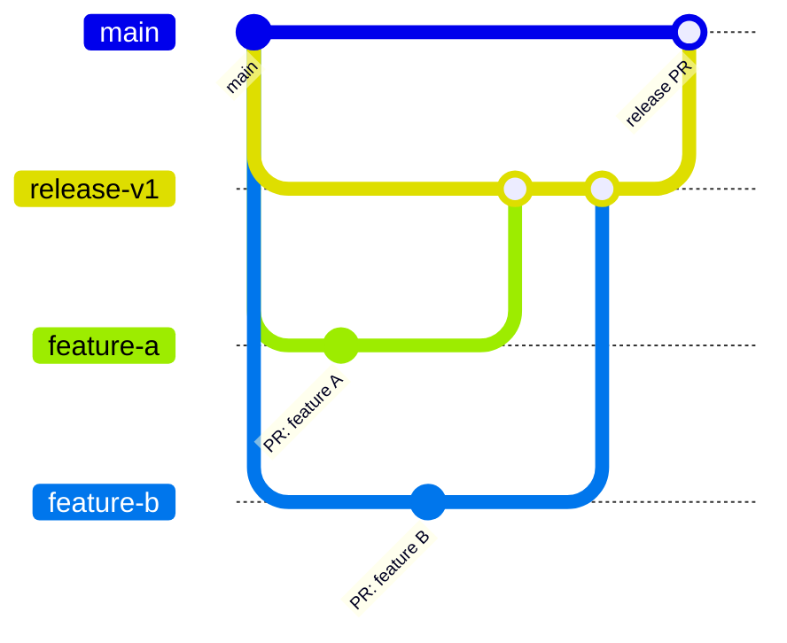

# Release Branch Pattern

Use a release branch to concentrate several related feature changes into one release, when the changes are independent of each other but should ship, close their issues, and generate release notes together.

This differs from [Module Bootstrap](module-bootstrap.md), which exists only to get a brand-new module's load-bearing core to its first release, and from a [stacked pull request](https://msxorg.github.io/docs/Ways-of-Working/Branching-and-Merging/#stacked-pull-requests), where each layer depends on the one before it. The release branch pattern applies to any module that already has a release, for a batch of independent features destined for the same version bump.

## Pattern

1. Cut one release branch from `main`, named for the release, e.g. `release-v1`.
2. Open the **release pull request** immediately: release branch → `main`, as a **draft**. This PR stays open for the lifetime of the release and accumulates the `Closes #N` references for every issue the release resolves.
3. Cut each feature branch from the release branch, not from `main`.
4. Open each **feature pull request** targeting the release branch, not `main`. Feature PRs can land in parallel and in any order relative to each other, unless one feature explicitly depends on another (in which case stack those two normally).
5. Merge feature PRs into the release branch as they become ready.
6. Once every planned feature PR has merged into the release branch, un-draft the release PR and merge it into `main`. This merge becomes the release.

## Release pull request body

The release PR is the single place that:

- Lists `Closes #N` for every issue resolved by any feature PR merged into the release branch.
- Carries the combined release notes, written per [MSXOrg PR Format](https://msxorg.github.io/docs/Ways-of-Working/PR-Format.md), once every feature has landed.

Feature PRs still follow PR Format for their own description, but do not need to duplicate `Closes #N` — the release PR is the one that closes issues when it merges to `main`.

## Merge order

- Merge feature PRs in dependency order. Independent feature PRs have no required order between them.
- The release PR always merges last, after every feature PR it depends on has landed in the release branch.
- Keep the release PR in draft for as long as feature PRs are still expected. Un-draft it only once the release branch is feature-complete and passing checks.

## When to use this

- The module already has a stable release, and several independent features are queued for the next version.
- Skip this pattern for a single isolated change — use an ordinary topic branch targeting `main` directly.
- Skip this pattern for a brand-new module with no release yet — use [Module Bootstrap](module-bootstrap.md) instead.
- Use a [stacked pull request](https://msxorg.github.io/docs/Ways-of-Working/Branching-and-Merging/#stacked-pull-requests) instead when changes genuinely depend on each other in sequence, rather than being independent features batched into one release.

For the general branching and merge model, see [MSX Branching and Merging](https://msxorg.github.io/docs/Ways-of-Working/Branching-and-Merging/).
