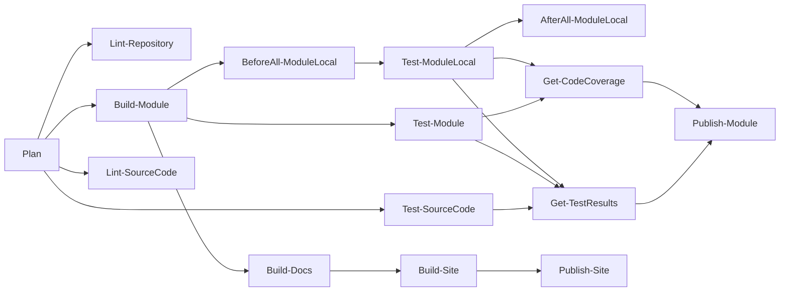

# PowerShell module standard

Standards for implementing and reviewing PowerShell modules in the PSModule organization. These rules apply to modules built with the [PSModule framework](https://github.com/PSModule/Process-PSModule).

For general PowerShell coding standards (naming, style, function structure, documentation, readability, error handling), see [PowerShell Standards](../Standard/index.md). This page covers only module-specific conventions.

> **Repo-local config wins.** Repo-level `.github/linters/.powershell-psscriptanalyzer.psd1` and `.github/PSModule.yml` override anything below. This standard fills the gap.

## Repository layout

The framework treats `src/` as the source for the compiled module. Place code in the folder that matches its responsibility.

| Folder or file                                | Purpose                                                                   | Do not put here                                          |
| --------------------------------------------- | ------------------------------------------------------------------------- | -------------------------------------------------------- |
| `src/header.ps1`                              | Single comment block at the top of the compiled module                    | Runtime code                                             |
| `src/manifest.psd1`                           | Intentional manifest overrides (e.g., `Author`)                           | Generated values (functions, types, version, GUID, etc.) |
| `src/data/*.psd1`                             | Static read-only configuration                                            | Mutable state, secrets, computed values                  |
| `src/init/*.ps1`                              | Code that runs once at import (module-scope init, completer registration) | Per-call logic, network calls, slow work                 |
| `src/classes/private/*.ps1`                   | Internal classes                                                          | Public pipeline output types                             |
| `src/classes/public/*.ps1`                    | Classes returned to users or accepted as parameter types                  | Transport wrappers with no user-facing model             |
| `src/enums/*.ps1`                             | Enums for class properties, parameters, validation                        | Configuration constants                                  |
| `src/types/<TypeName>.Types.ps1xml`           | Type metadata — aliases, script properties, member sets                   | Display views or duplicated class properties             |
| `src/formats/<TypeName>.Format.ps1xml`        | Default table / list / wide display views                                 | Behavior, business logic, type aliases                   |
| `src/functions/private/<Group>/Verb-Noun.ps1` | One private helper per file, grouped by domain                            | Public aliases, pipeline input, context defaulting       |
| `src/functions/public/<Group>/Verb-Noun.ps1`  | One exported command per file, grouped by resource or domain              | Raw transport code, multiple commands per file           |
| `src/assemblies/`                             | Bundled binaries copied into the build artifact                           | Source-compiled code                                     |
| `src/modules/`                                | Nested modules packaged with the compiled output                          | Functions that belong in `src/functions/`                |
| `src/variables/private/*.ps1`                 | Module-scoped variables not exported                                      | Public API values                                        |
| `src/variables/public/*.ps1`                  | Variables exported and documented                                         | Computed or mutable state                                |
| `src/scripts/*.ps1`                           | Scripts loaded via the manifest into caller scope                         | Normal module-internal code                              |
| `src/finally.ps1`                             | End-of-module wiring (removal handlers, etc.)                             | Per-call logic                                           |
| `examples/*.ps1`                              | Realistic user scenarios                                                  | Substitutes for comment-based help examples              |
| `icon/icon.png`                               | Module icon linked from manifest and documentation                        | Source code or configuration                             |
| `tests/`                                      | Pester tests and test data                                                | Generated test results or build output                   |
| `tests/BeforeAll.ps1`                         | Shared setup script executed once before the test matrix                  | Per-test setup                                           |
| `tests/AfterAll.ps1`                          | Shared teardown script executed once after the test matrix                | Per-test teardown                                        |
| `.github/PSModule.yml`                        | Workflow configuration (build, test, publish, linter settings)            | Source code or runtime config                            |
| `tools/*.ps1`                                 | Build-time helper scripts (numbered for execution order)                  | Runtime module code                                      |

Layout rules:

- **One declaration per file.** Filename matches the declared symbol exactly, including casing.
- **Group by domain.** Use resource or behaviour groups — not verb folders, not endpoint paths.
- **Mirror public and private domains.** Public command under `src/functions/public/Projects/` has related private helpers under `src/functions/private/Projects/`.
- **Declare dependencies where they are used.** Use `#Requires -Modules <Name>` at the top of each function file that needs an external module. Do not add `RequiredModules` to `src/manifest.psd1` — the build collects all `#Requires` declarations automatically and writes them into the compiled manifest. Entries in `src/manifest.psd1` are silently ignored for this purpose.
- **Group documentation pages with source.** Place a `<Group>.md` file alongside the function files in each `src/functions/public/<Group>/` folder to provide a category overview in generated documentation.

## Module naming

- Prefix public nouns with the module's term of art: `ContosoProject`, not `Project`.
- Public aliases only when they preserve compatibility or bridge terminology. Private functions and parameters have no aliases.

## Private functions

- Mandatory context parameter (e.g., `[GitHubContext] $Context`) or equivalent for the module.
- No aliases.
- No pipeline input.
- No defaulting from context — public callers resolve before calling.
- Required inputs declared as mandatory.

## SOLID applied

- **Single Responsibility.** One file, one function. One function, one user-visible behaviour. If the synopsis needs "and", split it.
- **Open/Closed.** Extend via parameter sets, private helpers, or new files — not boolean switches that fork large blocks.
- **Liskov.** A derived class must work wherever the base is expected.
- **Interface Segregation.** Narrow, intent-named parameter sets.
- **Dependency Inversion.** Public functions depend on resolved inputs and local abstractions. Private helpers own the concrete REST / GraphQL / filesystem / process calls.

## Parameter design

### Smart defaults

Every parameter that has a natural default should declare one. The most common use case must work with the fewest parameters possible. Reserve `Mandatory` for values the command genuinely cannot infer or derive.

- Prefer `= 'main'` over making `-Branch` mandatory in commands that act on branches.
- Prefer sensible page sizes, counts, or ranges over requiring callers to specify them.
- Prefer `= $false` for switches rather than leaving the behaviour implicit.

This is a usability expression of the **Open/Closed** principle: the common path is open by default; callers that need different behaviour extend it by supplying alternatives — they are never forced to know the default just to get started.

### Object-first parameters

Parameters represent attributes of a real-world entity. Design them to reflect that structure.

- **Prefer typed objects.** If a concept has a class — `[GitHubRepo]`, `[GitHubContext]`, `[ContosoProject]` — accept the object rather than its constituent fields. The caller can pass the whole thing; the implementation unpacks what it needs.
- **Group flat parameters by their conceptual object.** When a typed object is not available, prefix each parameter with the name of the entity it belongs to: `$ServerHost`, `$ServerPort`, `$ServerTls` rather than `$Host`, `$Port`, `$Tls`. The prefix makes the grouping explicit, prevents collisions with unrelated parameters, and avoids shadowing PowerShell built-in variables (`$Host`).
- **Offer both modes when callers need both.** A parameter set that accepts an object and a parallel parameter set that accepts its individual attributes are equally valid; use both when that genuinely serves users.

This mirrors **Interface Segregation**: each parameter set represents one coherent input contract — not a flat list of loosely related knobs — so callers only touch what they need.

> Note: the rule "avoid repeating the noun" (e.g. `-ID` not `-ProjectID` in `Get-ContosoProject`) applies to a command's *own* noun. The object-prefix convention above applies when a single command spans *multiple* conceptual objects (`$ServerHost` vs `$ClientID`) — the prefix is the object name, not the command noun, so there is no conflict.

## DRY with judgment

Extract a helper after the same non-trivial logic appears in three or more places, or when duplicated logic is load-bearing. Don't create a helper for a single caller.

## Principles

### Colocation of concerns

Keep related things together so the connection between code and its context is visible at a glance:

- `#Requires -Modules` belongs in the function files that use the dependency, not in a central manifest.
- Parameter descriptions are `#` comments directly above each parameter in `param()`, not `.PARAMETER` blocks.
- Tests for a public function live alongside it, not in a separate unrelated folder.

### Linear versioning

The release process treats each merged PR as a release on a single linear ancestry. There is no patching of older versions — security fixes go on the current tip of `main` only.

### Release and feature branches

For large work, open a release branch and target it from feature branches. Apply the `Prerelease` label on the release branch PR to publish preview versions before the final merge to `main`.

## CI/CD pipeline

The [Process-PSModule](https://github.com/PSModule/Process-PSModule) workflow orchestrates the full lifecycle. Every PR triggers a **Plan** job that resolves configuration and version, then conditionally runs build, test, lint, and publish stages.

### Pipeline stages



| Stage | Runs on | Purpose |
| ----- | ------- | ------- |
| **Plan** | All events | Loads `.github/PSModule.yml`, resolves version from PR labels, produces the Settings JSON |
| **Lint-Repository** | Open/Updated PR | Runs super-linter on the full repo (Markdown, YAML, etc.) |
| **Lint-SourceCode** | Open/Updated PR, Merged PR, Manual | Runs PSScriptAnalyzer against `src/` |
| **Build-Module** | Open/Updated PR, Merged PR, Manual | Compiles source into a versioned module artifact |
| **Test-SourceCode** | Open/Updated PR, Merged PR, Manual | Framework tests on raw source files |
| **Test-Module** | Open/Updated PR, Merged PR, Manual | Pester tests against the built module artifact |
| **BeforeAll-ModuleLocal** | Open/Updated PR, Merged PR, Manual | Runs `tests/BeforeAll.ps1` once before the local test matrix |
| **Test-ModuleLocal** | Open/Updated PR, Merged PR, Manual | Pester tests with the module installed locally (cross-OS matrix) |
| **AfterAll-ModuleLocal** | Always (if tests started) | Runs `tests/AfterAll.ps1` for cleanup |
| **Get-TestResults** | Always (if Plan succeeded) | Aggregates and reports test results |
| **Get-CodeCoverage** | Always (if Plan succeeded) | Calculates and reports code coverage |
| **Publish-Module** | Merged PR (or Prerelease label) | Publishes to PowerShell Gallery and creates a GitHub Release |
| **Build-Docs / Build-Site** | Open/Updated PR, Merged PR, Manual | Generates documentation site from source |
| **Publish-Site** | Merged PR | Deploys documentation site to GitHub Pages |

### Important file patterns

The workflow only triggers build, test, and publish stages when changed files match the `ImportantFilePatterns` setting. The default patterns are:

```text
^src/
^README\.md$
```

Changes that do not match any pattern result in `ReleaseType: None` — the pipeline skips build, test, and publish entirely. Override in `.github/PSModule.yml`:

```yaml
ImportantFilePatterns:
  - '^src/'
  - '^README\.md$'
  - '^\.github/workflows/'
```

### Version resolution

The **Plan** job resolves the next version before any build occurs. This means the tested artifact carries the exact version that will be published — no re-stamping happens at publish time.

**Flow:**

1. `Get-PSModuleSettings` loads `.github/PSModule.yml` and determines `ReleaseType` from PR labels
2. `Resolve-PSModuleVersion` calculates the next semantic version from the latest Git tag
3. `Build-PSModule` stamps the resolved version into the compiled manifest
4. `Publish-PSModule` reads the version from the manifest (read-only) and publishes

**PR label to version bump mapping:**

| Labels (configurable) | Bump type | Default label values |
| --------------------- | --------- | -------------------- |
| Major | Major (`X.0.0`) | `major`, `breaking` |
| Minor | Minor (`x.Y.0`) | `minor`, `feature` |
| Patch | Patch (`x.y.Z`) | `patch`, `fix` |
| Ignore | No release | `NoRelease` |
| None of the above | Patch (when `AutoPatching: true`) | — |

**Prerelease versions:** Adding a `Prerelease` label to the PR produces a prerelease tag (e.g., `1.2.3-preview0001`). The format is controlled by `IncrementalPrerelease` (sequential numbering) or `DatePrereleaseFormat` (.NET DateTime format string).

**Tag format:** Releases are tagged with a configurable prefix (default `v`) — e.g., `v1.2.3`.

### Configuration (`.github/PSModule.yml`)

All settings have sensible defaults. An empty or missing file uses the defaults below:

```yaml
Name: null                      # Defaults to the repository name

ImportantFilePatterns:
  - '^src/'
  - '^README\.md$'

Build:
  Skip: false
  Module:
    Skip: false
  Docs:
    Skip: false
  Site:
    Skip: false

Test:
  Skip: false
  Linux:
    Skip: false
  MacOS:
    Skip: false
  Windows:
    Skip: false
  SourceCode:
    Skip: false
  PSModule:
    Skip: false
  Module:
    Skip: false
  TestResults:
    Skip: false
  CodeCoverage:
    Skip: false
    PercentTarget: 0

Publish:
  Module:
    Skip: false
    AutoCleanup: true           # Delete prerelease tags after stable release
    AutoPatching: true           # Unlabeled PRs default to patch bump
    IncrementalPrerelease: true  # Sequential prerelease numbering
    DatePrereleaseFormat: ''     # Alternative: .NET DateTime format for prerelease
    VersionPrefix: 'v'          # Git tag prefix
    MajorLabels: 'major, breaking'
    MinorLabels: 'minor, feature'
    PatchLabels: 'patch, fix'
    IgnoreLabels: 'NoRelease'
    UsePRTitleAsReleaseName: false
    UsePRBodyAsReleaseNotes: true
    UsePRTitleAsNotesHeading: true

Linter:
  Skip: false
  env: {}                       # Additional env vars passed to super-linter
```

### Publishing

The `Publish-Module` stage:

1. Downloads the pre-built module artifact (identical to what was tested)
2. Reads the version from the compiled manifest (no recalculation)
3. Publishes to the PowerShell Gallery
4. Creates a GitHub Release with the module attached as a ZIP artifact
5. Comments on the PR with links to the Gallery package and GitHub Release
6. Cleans up old prerelease tags when publishing a stable release (if `AutoCleanup: true`)

The publish step only runs when:

- All tests and code coverage pass (or are skipped)
- The PR is merged to the default branch (stable release), or
- The PR carries the `Prerelease` label (prerelease from the feature/release branch)

On abandoned (closed without merge) PRs, the pipeline cleans up any prerelease tags created for that branch.

## Tests

- Pester tests under `tests/`.
- Filenames: `<ModuleName>.Tests.ps1` or `<Function>.Tests.ps1`.
- One test file per public command for unit tests; integration tests grouped by scenario.
- Tests run against the built module artifact installed locally, across a multi-OS matrix (Linux, macOS, Windows).

### Shared test infrastructure

Tests run in parallel across multiple OS runners. Provision shared infrastructure once rather than inside each test file:

- `tests/BeforeAll.ps1` — runs once before the full test matrix. Create shared resources here.
- `tests/AfterAll.ps1` — runs once after the full test matrix. Remove shared resources here.

Use `$env:GITHUB_RUN_ID` (stable per workflow run, shared across all runners) for deterministic resource names:

```powershell
$resourceName = "Test-$($env:RUNNER_OS)-$($env:GITHUB_RUN_ID)"
```

Do not use `[guid]::NewGuid()` or `Get-Random` for shared names — these produce different values on each runner. Clean up stale resources at the start of `BeforeAll.ps1` before creating new ones.

### Enforced framework tests

The CI pipeline automatically tests every source file against the following rules. Violations fail the build:

| Test ID | Rule |
| ------- | ---- |
| `NumberOfProcessors` | Use `[System.Environment]::ProcessorCount`, not `$env:NUMBER_OF_PROCESSORS` |
| `Verbose` | Do not pass `-Verbose` to commands unless explicitly silenced with `-Verbose:$false` |
| `OutNull` | Use `$null = ...` instead of `\| Out-Null` |
| `NoTernary` | No ternary operators — maintain PowerShell 5.1 compatibility |
| `LowercaseKeywords` | All PowerShell keywords must be lowercase |
| `FunctionCount` | Each file must contain exactly one function or filter |
| `FunctionName` | Filename must match the function or filter name |
| `CmdletBinding` | Every function must have `[CmdletBinding()]` |
| `ParamBlock` | Every function must have a `param()` block |
| `FunctionTest` | Every public function must have a corresponding test |

To skip a specific rule for one file only, add a comment at the very top of that file:

```powershell
#SkipTest:<TestID>:<Reason>
```

Use skip comments sparingly and always include a meaningful reason. Prefer refactoring to comply over skipping.

### PSScriptAnalyzer linting

Source code is linted with PSScriptAnalyzer using the repo-level settings at `.github/linters/.powershell-psscriptanalyzer.psd1`. Key enforced rules include:

- `PSAlignAssignmentStatement` — aligned assignment operators in hashtables
- `PSAvoidLongLines` — maximum 150 characters per line
- `PSAvoidSemicolonsAsLineTerminators` — no trailing semicolons
- `PSPlaceOpenBrace` / `PSPlaceCloseBrace` — OTBS brace style
- `PSUseConsistentIndentation` — 4-space indentation
- `PSUseConsistentWhitespace` — consistent spacing around operators, pipes, and separators
